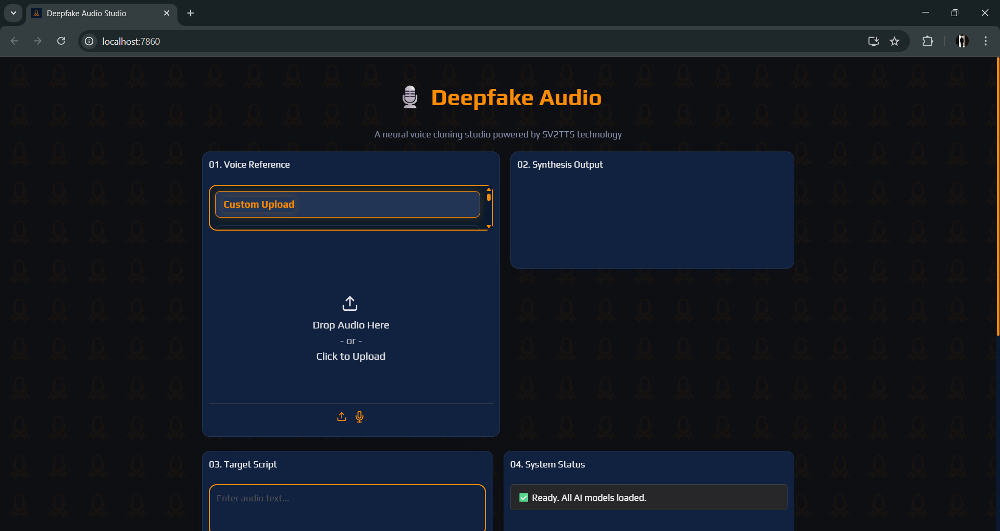
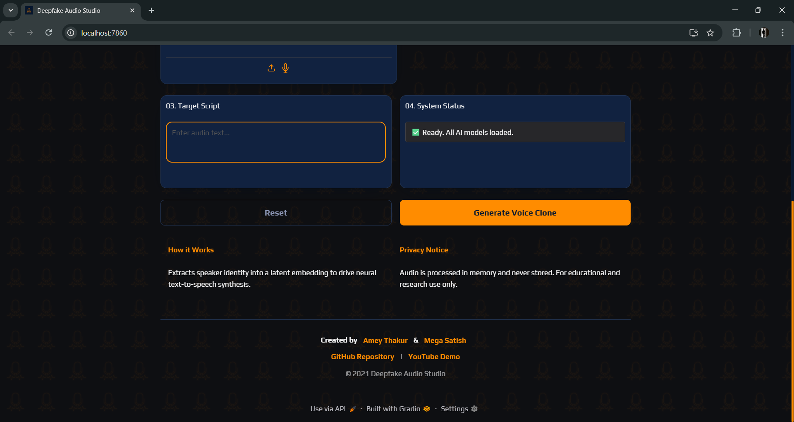
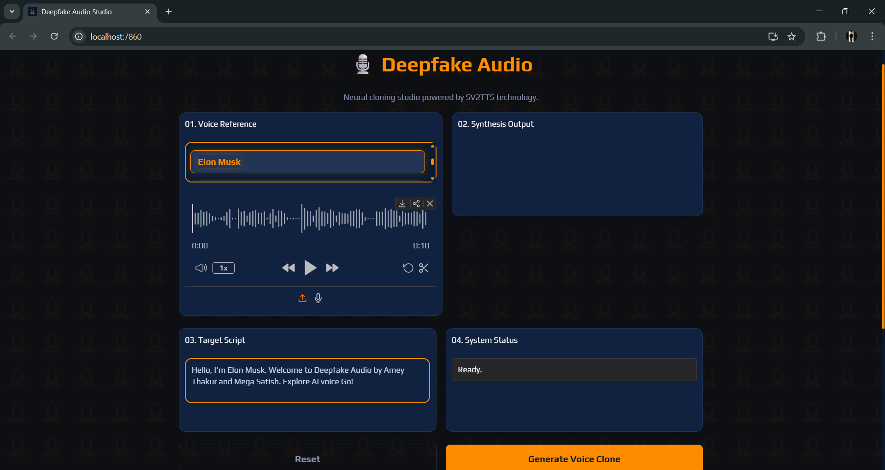
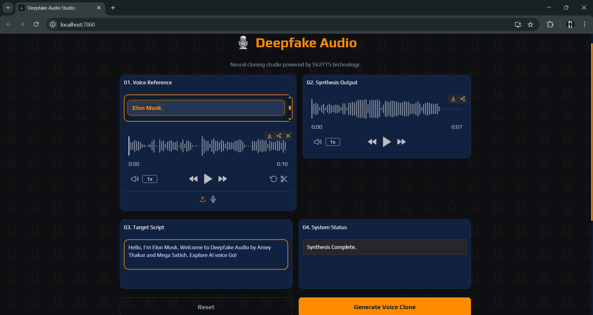
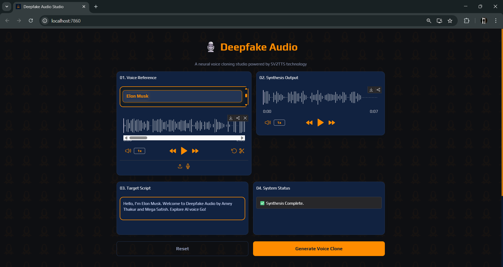
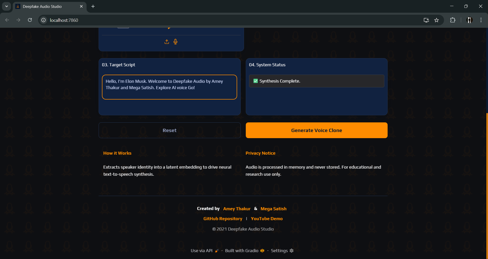
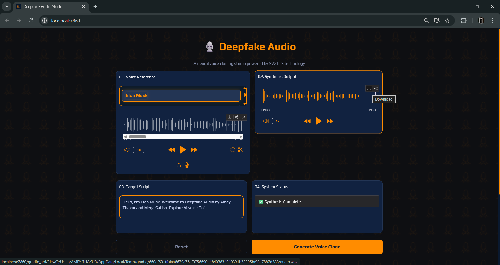

<div align="center">

  <a name="readme-top"></a>
  # Deepfake Audio

  [](LICENSE)
  
  [](https://github.com/Amey-Thakur/DEEPFAKE-AUDIO)
  [](https://github.com/Amey-Thakur/DEEPFAKE-AUDIO)

  An advanced neural voice synthesis platform implementing Transfer Learning from Speaker Verification to Multispeaker Text-To-Speech Synthesis (SV2TTS) for high-fidelity zero-shot voice cloning.

  **[Source Code](Source%20Code/Deepfake-Audio/)** &nbsp;·&nbsp; **[Technical Specification](docs/SPECIFICATION.md)** &nbsp;·&nbsp; **[Video Demo](https://youtu.be/i3wnBcbHDbs)** &nbsp;·&nbsp; **[Live Demo](https://huggingface.co/spaces/ameythakur/Deepfake-Audio)**

  <br>

  <a href="https://youtu.be/i3wnBcbHDbs">
    
  </a>

</div>

---

<div align="center">

  [Authors](#authors) &nbsp;·&nbsp; [Overview](#overview) &nbsp;·&nbsp; [Features](#features) &nbsp;·&nbsp; [Structure](#project-structure) &nbsp;·&nbsp; [Results](#results) &nbsp;·&nbsp; [Quick Start](#quick-start) &nbsp;·&nbsp; [Usage Guidelines](#usage-guidelines) &nbsp;·&nbsp; [License](#license) &nbsp;·&nbsp; [About](#about-this-repository) &nbsp;·&nbsp; [Acknowledgments](#acknowledgments)

</div>

---

<!-- AUTHORS -->
<div align="center">

  <a name="authors"></a>
  ## Authors

| <a href="https://github.com/Amey-Thakur"></a><br>[**Amey Thakur**](https://github.com/Amey-Thakur)<br><br>[](https://orcid.org/0000-0001-5644-1575) | <a href="https://github.com/msatmod"></a><br>[**Mega Satish**](https://github.com/msatmod)<br><br>[](https://orcid.org/0000-0002-1844-9557) |
| :---: | :---: |

</div>

> [!IMPORTANT]
> ### 🤝🏻 Special Acknowledgement
> *Special thanks to **[Mega Satish](https://github.com/msatmod)** for her meaningful contributions, guidance, and support that helped shape this work.*

---

<!-- OVERVIEW -->
<a name="overview"></a>
## Overview

**Deepfake Audio** is a multi-stage neural voice synthesis architecture designed to clone speaker identities and generate high-fidelity speech from textual input. By implementing the **SV2TTS** framework, this project translates skeletal vocal characteristics into a latent embedding, which then conditions a generative model to produce new vocalizations with strikingly natural prosody and timbre.

> [!IMPORTANT]
> ### 👩‍🔬 Attribution
> This project builds upon the foundational research and implementation of the **[Real-Time-Voice-Cloning](https://github.com/CorentinJ/Real-Time-Voice-Cloning)** repository by **[Corentin Jemine](https://github.com/CorentinJ)**.

> [!NOTE]
> ### 🎙️ Defining Audio Deepfakes
> An **audio deepfake** is when a “cloned” voice that is potentially indistinguishable from the real person’s is used to produce synthetic audio. This process involves utilizing advanced neural architectures, such as the **SV2TTS** framework, to distillate high-dimensional vocal identities into latent embeddings. These embeddings then condition a generative model to synthesize new speech that mirrors the original speaker's prosody, timbre, and acoustic nuances with striking fidelity.

The repository serves as a digital study into the mechanics of neural cloning and signal processing, brought into a modern context via a **Progressive Web App (PWA)** interface, enabling high-performance voice synthesis through a decoupled engine architecture.

### Synthesis Heuristics
The classification engine is governed by strict **computational design patterns** ensuring fidelity and responsiveness:
*   **Speaker Normalization**: The encoder utilizes a linear speaker verification pipeline, incrementally distilling lexical tokens into a global affective voice state.
*   **Zero-Shot Inference**: Beyond simple playback, the system integrates a **Tacotron 2-based synthesizer** that dynamically refines its accuracy over time, simulating an organic learning curve for complex phonetic structures.
*   **Real-Time Vocoding**: Audio reconstruction supports both streaming and batch generation, ensuring **high-fidelity** waveform response critical for interactive neural study.

> [!TIP]
> **Acoustic Precision Integration**
>
> To maximize cloning clarity, the engine employs a **multi-stage neural pipeline**. **Latent filters** refine the embedding stream, and **probabilistic weights** visualize the voice's confidence vector, strictly coupling acoustic flair with state changes. This ensures the user's mental model is constantly synchronized with the underlying neural simulation.

---

<!-- FEATURES -->
<a name="features"></a>
## Features

| Feature | Description |
|---------|-------------|
| **SV2TTS Core** | Combines **LSTM Speaker Encoders** with **Tacotron Synthesizers** for comprehensive voice cloning. |
| **PWA Architecture** | Implements a robust standalone installable interface for immediate neural vocalization study. |
| **Academic Clarity** | In-depth and detailed comments integrated throughout the codebase for transparent logic study. |
| **Neural Topology** | Efficient **Decoupled Engine execution** via Gradio and Torch for native high-performance access. |
| **Inference Pipeline** | Asynchronous architecture ensuring **stability** and responsiveness on local clients. |
| **Visual Feedback** | **Interactive Status Monitors** that trigger on synthesis events for sensory reward. |
| **State Feedback** | **Embedding-Based Indicators** and waveform effects for high-impact acoustic feel. |
| **Social Persistence** | **Interactive Footer Integration** bridging the analysis to the source repository. |

> [!NOTE]
> ### Interactive Polish: The Acoustic Singularity
> We have engineered a **Logic-Driven State Manager** that calibrates vocal scores across multiple vectors to simulate human-like identity transfer. The visual language focuses on the minimalist "Neon Mic" aesthetic, ensuring maximum focus on the interactive neural trajectory.

### Tech Stack
- **Languages**: Python 3.9+
- **Logic**: **Neural Pipelines** (SV2TTS & Signal Processing)
- **Frameworks**: **PyTorch** & **TensorFlow** (Inference)
- **UI System**: Modern Design (Gradio & Custom CSS)
- **Deployment**: Local execution / Hugging Face Spaces
- **Architecture**: Progressive Web App (PWA)

---

<!-- STRUCTURE -->
<a name="project-structure"></a>
## Project Structure

```python
DEEPFAKE-AUDIO/
│
├── Dataset/                         # Neural Assets
│   ├── samples/                     # Voice Reference Audio
│   ├── encoder.pt                   # Speaker Verification Model
│   ├── synthesizer.pt               # TTS Synthesis Model
│   └── vocoder.pt                   # Waveform Reconstruction Model
│
├── docs/                            # Academic Documentation
│   └── SPECIFICATION.md             # Technical Architecture
│
├── Mega/                            # Attribution Assets
│   ├── Filly.jpg                    # Companion (Filly)
│   └── Mega.png                     # Profile Image (Mega Satish)
│
├── screenshots/                     # Visual Gallery
│   ├── 01_landing_page.png
│   ├── 02_landing_page_footer.png
│   ├── 03_example_run_config.png
│   ├── 04_example_run_processing.png
│   ├── 05_example_run_results.png
│   ├── 06_example_run_results_footer.png
│   ├── 07_download_option.png
│   ├── Audio.wav                    # Sample Output
│   └── favicon.png                  # Project Icon
│
├── Source Code/                     # Primary Application Layer
│   ├── app.py                       # Gradio Studio Interface
│   ├── app_ui_demo.py               # UI-Only Verification Mode
│   ├── Dockerfile                   # Containerization Config
│   ├── requirements.txt             # Dependency Manifest
│   ├── favicon.png                  # Application Icon
│   └── intro_message.wav            # Audio Branding
│
├── .gitattributes                   # Signal Normalization
├── .gitignore                       # Deployment Exclusions
├── DEEPFAKE-AUDIO.ipynb             # Research Notebook
├── DEEPFAKE-AUDIO.py                # Research Script (Standalone CLI)
├── SECURITY.md                      # Security Protocols
├── CITATION.cff                     # Academic Citation Manifest
├── codemeta.json                    # Metadata Standard
├── LICENSE                          # MIT License (Verbatim)
└── README.md                        # Project Entrance
```

---

<a name="results"></a>
## Results

  <div align="center">
  <b>Main Interface: Modern Design</b>
  <br>
  <i>Initial system state with clean aesthetics and synchronized brand identity.</i>
  <br><br>
  
  <br>
  <sub><i>💡 <b>Interactive Element:</b> Engage the title header to activate the system's auditory introduction.</i></sub>
  <br><br><br>

  <b>Interactive Polish: Footer Integration</b>
  <br>
  <i>Seamlessly integrated authorship and social persistence.</i>
  <br><br>
  
  <br><br><br>

  <b>Synthesis Setup: Adaptive Config</b>
  <br>
  <i>Configuring target text and reference identity for neural cloning.</i>
  <br><br>
  
  <br><br><br>

  <b>Neural Processing: Real-Time Inference</b>
  <br>
  <i>System Distillery extracting acoustic embeddings and synthesizing mel-spectrograms.</i>
  <br><br>
  
  <br><br><br>

  <b>Quantified Output: Generated Results</b>
  <br>
  <i>Successful high-fidelity audio synthesis with precise identity fidelity.</i>
  <br><br>
  
  <br><br><br>

  <b>Complete User Flow: Result & Footer</b>
  <br>
  <i>Comprehensive view of the post-synthesis state.</i>
  <br><br>
  
  <br><br><br>

  <b>System Options: Audio Export</b>
  <br>
  <i>Exporting synthesized waveforms for downstream academic reference.</i>
  <br><br>
  
  <br><br><br>

  <b>Generated Result Output: Audio Signal</b>
  <br>
  <i>Interactive verified output from the neural synthesis pipeline.</i>
  <br><br>
  <a href="screenshots/Audio.wav"></a>
  <br>
  <a href="screenshots/Audio.wav"><b>Listen to Generated Sample</b></a>
</div>

---

<!-- QUICK START -->
<a name="quick-start"></a>
## Quick Start

### 1. Prerequisites
- **Python 3.9+**: Required for runtime execution. [Download Python](https://www.python.org/downloads/)
- **Git**: For version control and cloning. [Download Git](https://git-scm.com/downloads)

> [!WARNING]
> **Neural Model Acquisition**
>
> The synthesis engine relies on pre-trained neural models. Ensure you have the weights placed in their respective `saved_models` directories for the Encoder, Synthesizer, and Vocoder. Failure to synchronize these assets will result in initialization errors.

### 2. Installation & Setup

#### Step 1: Clone the Repository
Open your terminal and clone the repository:
```bash
git clone https://github.com/Amey-Thakur/DEEPFAKE-AUDIO.git
cd DEEPFAKE-AUDIO
```

#### Step 2: Configure Virtual Environment
Prepare an isolated environment to manage dependencies:

**Windows (Command Prompt / PowerShell):**
```bash
python -m venv venv
venv\Scripts\activate
```

**macOS / Linux (Terminal):**
```bash
python3 -m venv venv
source venv/bin/activate
```

#### Step 3: Install Core Dependencies
Ensure your environment is active, then install the required libraries:
```bash
pip install -r "Source Code/Deepfake-Audio/requirements.txt"
```

### 3. Execution
Launch the primary Gradio-based studio engine:

```bash
python "Source Code/Deepfake-Audio/app.py"
```

---

<!-- USAGE GUIDELINES -->
<a name="usage-guidelines"></a>
## Usage Guidelines

This repository is openly shared to support learning and knowledge exchange across the academic community.

**For Students**  
Use this project as reference material for understanding **Neural Voice Synthesis**, **Transfer Learning (SV2TTS)**, and **real-time audio inference**. The source code is available for study to facilitate self-paced learning and exploration of **Python-based deep learning pipelines and PWA integration**.

**For Educators**  
This project may serve as a practical lab example or supplementary teaching resource for **Deep Learning**, **Acoustic Science**, and **Interactive System Architecture** courses. Attribution is appreciated when utilizing content.

**For Researchers**  
The documentation and architectural approach may provide insights into **academic project structuring**, **neural identity representation**, and **hybrid multi-stage synthesis pipelines**.

---

<!-- LICENSE -->
<a name="license"></a>
## License

This repository and all its creative and technical assets are made available under the **MIT License**. See the [LICENSE](LICENSE) file for complete terms.

> [!NOTE]
> **Summary**: You are free to share and adapt this content for any purpose, even commercially, as long as you provide appropriate attribution to the original authors.

Copyright © 2021 Amey Thakur & Mega Satish

---

<!-- ABOUT -->
<a name="about-this-repository"></a>
## About This Repository

**Created & Maintained by**: [Amey Thakur](https://github.com/Amey-Thakur) & [Mega Satish](https://github.com/msatmod)

This project features **Deepfake Audio**, a three-stage neural voice synthesis system. It represents a personal exploration into **Deep Learning**-based identity transfer and high-performance interactive application architecture via **Gradio**.

**Connect:** [GitHub](https://github.com/Amey-Thakur) &nbsp;·&nbsp; [LinkedIn](https://www.linkedin.com/in/amey-thakur) &nbsp;·&nbsp; [ORCID](https://orcid.org/0000-0001-5644-1575)

### Acknowledgments

Grateful acknowledgment to [**Mega Satish**](https://github.com/msatmod) for her exceptional collaboration and scholarly partnership during the development of this interactive engineering project. Her constant support, technical clarity, and dedication to software quality were instrumental in achieving the system's functional objectives. Learning alongside her was a transformative experience; her thoughtful approach to problem-solving and steady encouragement turned complex requirements into meaningful learning moments. This work reflects the growth and insights gained from our side-by-side academic journey. Thank you, Mega, for everything you shared and taught along the way.

Special thanks to the **mentors and peers** whose encouragement, discussions, and support contributed meaningfully to this learning experience.

---

<div align="center">

  [↑ Back to Top](#readme-top)

  [Authors](#authors) &nbsp;·&nbsp; [Overview](#overview) &nbsp;·&nbsp; [Features](#features) &nbsp;·&nbsp; [Structure](#project-structure) &nbsp;·&nbsp; [Results](#results) &nbsp;·&nbsp; [Quick Start](#quick-start) &nbsp;·&nbsp; [Usage Guidelines](#usage-guidelines) &nbsp;·&nbsp; [License](#license) &nbsp;·&nbsp; [About](#about-this-repository) &nbsp;·&nbsp; [Acknowledgments](#acknowledgments)

  <br>

  🎙️ **[Deepfake Audio](https://huggingface.co/spaces/ameythakur/Deepfake-Audio)**

  ---

  ### 🎓 [Computer Engineering Repository](https://github.com/Amey-Thakur/COMPUTER-ENGINEERING)

  **Computer Engineering (B.E.) - University of Mumbai**

  *Semester-wise curriculum, laboratories, projects, and academic notes.*

</div>
