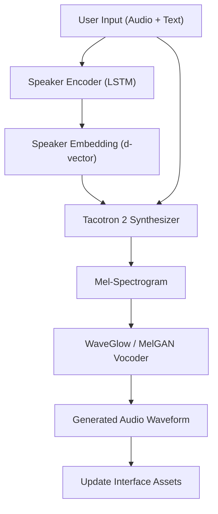

# Technical Specification: Deepfake Audio

## Architectural Overview

**Deepfake Audio** is a multi-stage neural voice synthesis architecture designed to clone speaker identities and generate high-fidelity speech from textual input. The system utilizes a Transfer Learning framework known as **SV2TTS** (Speaker Verification to Multispeaker Text-To-Speech Synthesis), integrating three distinct deep learning components to achieve zero-shot voice cloning.

### Neural Pipeline Flow

---

## Technical Implementations

### 1. Engine Architecture
-   **Core Interface**: Built on **Gradio**, providing a highly responsive and intuitive web-based HMI for real-time interaction and synthesis monitoring.
-   **Neural Topology**: Employs a three-stage decoupled architecture (Encoder, Synthesizer, Vocoder), allowing for independent optimization and high-dimensional speaker representation.

### 2. Logic & Inference
-   **Speaker Encoding**: Utilizes a pre-trained **LSTM** network to extract a fixed-dimensional speaker embedding from a short reference audio clip, capturing core vocal characteristics.
-   **Sequence Synthesis**: Implements a modified **Tacotron 2** architecture to generate frame-level mel-spectrograms conditioned on both the speaker embedding and target text.
-   **Waveform Reconstruction**: Employs neural vocoding (MelGAN/WaveGlow) to transcode mel-spectrograms into high-fidelity time-domain waveforms in real-time.

### 3. Deployment Pipeline
-   **Local Runtime**: Optimized for execution on **Python 3.9+** with Torch/TensorFlow backends, supporting both CPU and GPU-accelerated inference.
-   **Progressive Web App**: The application is configured as a **PWA**, enabling native-like installation on desktop and mobile platforms for an integrated user experience.

---

## Technical Prerequisites

-   **Runtime**: Python 3.9.x environment with Git and FFmpeg installed.
-   **Hardware**: Minimum 8GB RAM; NVIDIA GPU with CUDA support recommended for low-latency synthesis.

---

*Technical Specification | Python | Version 1.0*
